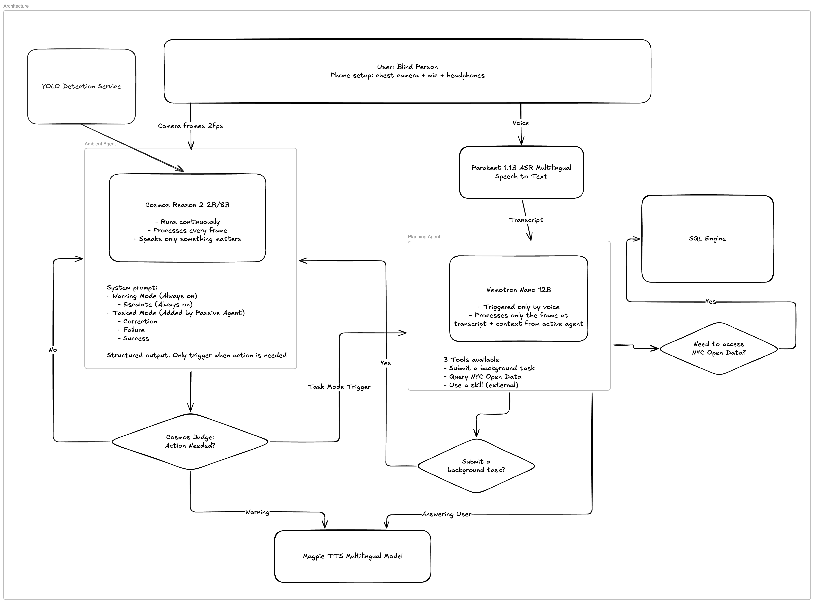

# Spark Sight

## Problem We Are Solving

800,000 New Yorkers live with a vision disability. They navigate a city where only 23% of subway stations are accessible, elevators break without warning, and over 8,000 scaffolding sheds turn sidewalks into obstacle courses.

No existing app combines real-time scene understanding with live city infrastructure data. Be My Eyes requires cloud connectivity and human volunteers. Seeing AI describes snapshots but doesn't track goals or warn about hazards proactively. Neither knows that the elevator at your station is broken or that there's scaffolding narrowing the sidewalk ahead.

**Spark Sight** is a fully local, private AI assistant that gives blind users real-time spatial awareness fused with live NYC data. It runs entirely on the NVIDIA GB10 — no cloud, no internet, no images ever leave the device.

Our two-agent architecture pairs **Cosmos Reason2** as a continuous ambient visual monitor with **Nemotron Nano** as an intelligent planner. When you say "take me to the subway," the Planning Agent checks which elevators are working, finds active scaffolding on your route, and programs the Ambient Agent to guide you there — warning about obstacles and tracking your progress until you arrive.

Four NVIDIA models. All multilingual. One device. Zero compromise on privacy. Designed to run entirely on a single NVIDIA GB10 with 128GB unified memory.

## Quick Start (Same Demo Env)

Spark Sight runs across three devices: the **DGX Spark (GB10)** hosts all AI models and data services, the **laptop** runs the orchestration layer, and an **iPhone** provides the live camera feed.

### 1. DGX Spark — Model Backend

**a. vLLM / NIM containers**
Configure models and API keys first:

```bash
bash scripts/gemma4_vllm_setup.sh
```

Configure models and API keys first — see [How to reproduce the demo](#how-to-reproduce-the-demo-env-vars-api-keys-sample-env) for required env vars. Then:

```bash
uv sync
cd nim-stack
./start.sh          # launches Nemotron, Cosmos, Magpie TTS, Parakeet ASR sequentially
./healthcheck.sh    # verify all four services are up
```

**b. YOLO detection service**

Go to the `yolo-stack`

```bash
pip install ultralytics

yolo export model=yolo11n.pt format=engine half=True imgsz=640 device=0

python server.py
```

**c. Street closure data server**

```bash
# Install dependencies (first time only)
pip install fastapi uvicorn pandas

cd closure-data
python server.py
# → listening on http://0.0.0.0:8010
```

### 2. Orchestrator

```bash
uv run python -m spark_sight.main --debug
# → note the URL/port printed to the console
```

### 3. iPhone — Camera

Open the URL printed by the laptop in Safari and grant camera access when prompted. You may need `ngrok` because Safari has https restrictions.

---

## How It Works

The user wears a chest-mounted iPhone in a MagSafe holder and headphones. They walk normally, speak naturally, and hear spoken responses.

The **Ambient Agent** runs continuously in the background — always watching through the camera, always ready to warn. It speaks only when something matters: an obstacle ahead, a course correction needed, or a goal reached. Most of the time, it is silent.

The **Planning Agent** wakes when the user speaks. It interprets what they want, searches NYC's accessibility data — subway stations, scaffolding permits, elevator outages, accessible pedestrian signals — and programs the Ambient Agent with a specific goal. Then it goes back to sleep.

The core innovation is this separation: the Ambient Agent is fast but narrow. The Planning Agent is slow but broad. Together they form a complete ambient intelligence.

# Tech Stack

### AI Models (all NVIDIA, All local)

| Model                               | Role                                                         | Size            | Deployment |
| ----------------------------------- | ------------------------------------------------------------ | --------------- | ---------- |
| **Cosmos Reason2 2B/8B**            | Ambient Agent — continuous visual monitoring, spatial reasoning, obstacle detection, goal tracking | 2B or 8B params | NIM        |
| **Nemotron Nano**                   | Planning Agent — triggered by voice, interprets user intent, queries NYC data, assigns goals to the Ambient Agent | 12B             | NIM        |
| **Parakeet 1.1B RNNT Multilingual** | Speech-to-text — streaming ASR with built-in VAD and automatic language detection (11 languages) | 1.1B params     | NIM        |
| **Magpie TTS Multilingual**         | Text-to-speech — expressive voice synthesis with streaming output (9 languages, multiple voices) | 357M params     | NIM        |

### Two-Agent Architecture




**Ambient Agent (Cosmos Reason2)** — the system's eyes. Runs a continuous frame-processing loop at ~1-2 FPS. Each frame is evaluated against a dynamic goal prompt composed of three layers: a base safety goal (always on — obstacle warnings, hazard detection), an optional active task goal (set by the Planning Agent — "guide user to subway entrance"), and NYC context (nearby scaffolding, elevator outages, accessible signals). The agent outputs structured signals: `CLEAR` (silence), `WARNING` (immediate danger), `PROGRESS` / `CORRECTION` / `GOAL_REACHED` / `FAILURE` (goal-tracking). Most frames produce silence — the agent speaks only when something is actionable.

**Planning Agent (Nemotron Nano)** — the system's brain. Sits idle until the user speaks or the Ambient Agent reports a failure. Interprets natural language requests, uses tools (NYC Open Data spatial queries, web search), and rewrites the Ambient Agent's goal prompt. Three tools available: submit a background task to the Ambient Agent, query NYC Open Data, and use external skills (web search).

**Communication**: the agents share a `PromptState` object managed by the Orchestrator. The Planning Agent writes goals and context into it. The Ambient Agent reads the compiled prompt on every frame. They never call each other directly.

### Infrastructure

| Component           | Technology                                                                        |
| ------------------- | --------------------------------------------------------------------------------- |
| Hardware            | NVIDIA GB10 Grace Blackwell Superchip (Acer Veriton GN100), 128GB unified LPDDR5x |
| Model serving       | NIM                                                                               |
| Speech serving      | NVIDIA NIM containers (Docker)                                                    |
| Agent orchestration | Python asyncio + Hugging Face smolagents (Planning Agent tool use)                |
| iPhone → Server     | Single WebSocket over HTTPS (FastAPI + uvicorn with self-signed cert)             |
| NYC data            | SQLite with spatial indexes, pre-cached from NYC Open Data SODA API               |
| Package management  | uv                                                                                |
| Web framework       | FastAPI                                                                           |

### iPhone Client

The iPhone serves as camera, microphone, and speaker. No native app — Safari opens a web page served by the GB10 over local WiFi. Camera frames (JPEG, 4 FPS) and mic audio (16kHz PCM) stream to the server over a single WebSocket. TTS audio and status updates stream back. HTTPS is required for Safari camera/mic access (self-signed cert via `mkcert`).

### NYC Open Data

Pre-cached in SQLite on the GB10's SSD. Queried by spatial lookups (`WHERE abs(lat-?) < radius`), not RAG or vector search. Datasets used:

| Dataset                                       | Source                                                                                                        | Provenance              |
| --------------------------------------------- | ------------------------------------------------------------------------------------------------------------- | ----------------------- |
| Accessible Pedestrian Signals                 | [NYC DOT](https://data.cityofnewyork.us/Transportation/Accessible-Pedestrian-Signal-Locations-Map-/umfn-twbz) | NYC Open Data, SODA API |
| MTA Elevator/Escalator Status                 | [MTA](https://data.ny.gov/resource/39hk-dx4f.json)                                                            | MTA Open Data           |
| Active Scaffolding Permits                    | [DOB NOW](https://data.cityofnewyork.us/resource/ipu4-2vj7.json)                                              | NYC Open Data, SODA API |
| 311 Service Requests (accessibility-filtered) | [NYC 311](https://data.cityofnewyork.us/resource/erm2-nwe9.json)                                              | NYC Open Data, SODA API |
| Pedestrian Ramp Locations                     | [NYC DOT](https://data.cityofnewyork.us/resource/t5cq-qf5c.json)                                              | NYC Open Data, SODA API |
| Subway Stations + ADA Status                  | [MTA](https://data.cityofnewyork.us/resource/kk4q-3rt2.json)                                                  | NYC/MTA Open Data       |

No synthetic data is used. All datasets are publicly available under NYC Open Data terms of use.

---

## Known Limitations

### Hardware & Latency

- **Cosmos inference latency determines frame rate.** The Ambient Agent processes frames as fast as inference allows (~1s per frame for 8B, faster for 2B). This yields 1 FPS, not true real-time video. Fast-moving obstacles (e.g., a cyclist at speed) may not be caught between frames.
- **Two large models sharing one GPU.** Cosmos and Nemotron Nano run on the same Blackwell GPU. If the Planning Agent triggers while Cosmos is mid-inference, one will queue behind the other. In practice this adds ~0.5s latency to Planning Agent responses.
- **TTS latency.** Magpie TTS generates full utterances before playback in offline mode. Streaming mode (WebSocket API) reduces time-to-first-audio but requires careful buffer management. The user may hear a ~200–500ms delay between the agent deciding to speak and audio starting.

### NYC Data

For this hackathon, not all the data points are integrated, but new connectors can easily be added.

- **Data freshness.** Scaffolding permits, elevator outages, and 311 reports are pre-cached before the demo. In production, these would sync periodically over WiFi. The MTA elevator feed updates every ~5 minutes; scaffolding permits update daily.
- **Coverage gaps.** Not all accessibility hazards are in the data. Temporary obstacles (delivery trucks, street vendors, trash bags) are only visible to the camera, not in the database. Construction not filed with DOB won't appear.

### Vision Model

- **Night and low-light performance is unknown.** Cosmos was primarily evaluated on well-lit scenarios. iPhone cameras have good low-light capability, but the VLM's accuracy in dark conditions has not been benchmarked.
- **No depth estimation.** Distance estimates ("5 feet ahead") are inferred from bounding box size and scene context, not from a depth sensor or stereo vision. These are approximate.

### Audio

- **Speech collision.** If the user speaks while TTS is playing, the mic picks up the TTS output. Echo cancellation is enabled in the browser but may not fully suppress it, causing ASR to transcribe the system's own speech.

### iPhone Client

- **Safari HTTPS requirement.** Camera and mic access require HTTPS. The self-signed certificate triggers a browser warning on first visit that must be manually accepted. This is a one-time step but is not accessible to a blind user without assistance.

### Architecture

- **No multi-step planning.** The Planning Agent sets one goal at a time. Complex requests like "go to the pharmacy, pick up my prescription, then take the subway to work" would need to be decomposed into sequential goals. Not implemented.

### Next Steps

- Fine-tune Cosmos on pedestrian navigation and accessibility-specific scenarios.
- Add conversation memory to the Planning Agent for multi-turn interactions.
- Add depth estimation (MiDaS or Depth Anything) for more accurate distance reporting.
- Build a proper accessible onboarding flow for the iPhone client (no visual setup steps).
- Benchmark Cosmos on low-light, rain, and crowd scenarios.
